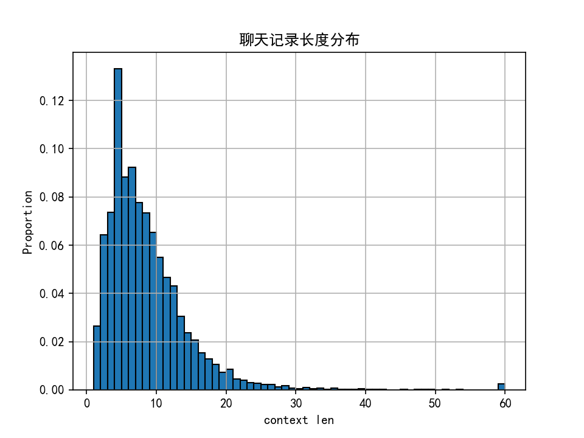

#### 数据特征

##### 多种数据格式

导出的聊天记录中，Type字段表示了数据的格式。1是文本，其他还有图片、转发聊天记录、语音、表情包、红包等多种数据格式。这里我们先只考虑最为简单的**纯文本格式**

后续如果想考虑更多的数据格式，我认为可以写一段翻译。比如遇到一个红包，可以把它变成文本格式的“A给B发了一个红包”；图片就是“A给B发了一个图片”。当然也可以用多模态的编码器什么的。

##### 短记录

由于聊天记录日常、口语、细碎等特点，短文本特别多，长度超过10的聊天记录仅占25%

所以在后续的分析中，一定要对文本进行拼接

##### 长记录

对于比较长的聊天记里，一般对应如下三种情况：

1. 转发的链接带有url链接：无意义，需要把url过滤掉，只保留标题
2. 转发的学校通知：保留
3. 真的比较长，用来把一件事情讲清楚：有价值，保留

#### 话题划分

这是本项目非常重点的一部分，话题切分的效果直接影响了后面排序召回的上限。核心目的就是，要让一个文本块中尽量只包含一个完整的话题，会涉及以下问题

* 长度不一，有的话题聊了好几百条，有的可能只有一两句
* 话题没有明确的开始or结束，并且可能相互掺杂
* 一个话题可能被多次提及，时间跨度长
* 其他

##### 仅根据长度划分

这里我采取一种最简单粗暴的方式，按照时间顺序拼接，长度大于100就再开始下一段的拼接。不考虑消息发送人、内容、时间等因素。

由于聊天记里基本没有标点符号，所以我在每次划分时，增加一个\<sep\>特殊字符。